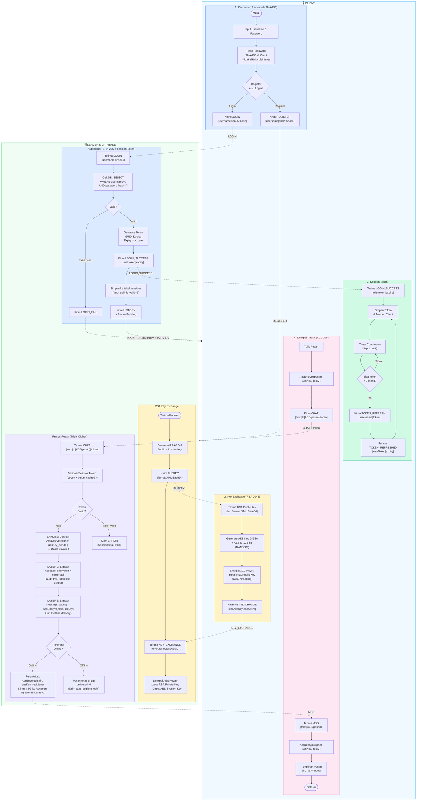

# Alur Proses Desain Keamanan Data — SecureChat

Diagram berikut menggambarkan seluruh alur keamanan data pada aplikasi SecureChat,
mencakup enkripsi password, key exchange RSA, session token, dan triple cipher enkripsi pesan.

---



---

## Keterangan Alur

### Client Pool

| Lane | Fungsi Keamanan |
|---|---|
| **1. Keamanan Password (SHA-256)** | Password di-hash SHA-256 di sisi client sebelum dikirim. Server tidak pernah menerima password asli. |
| **2. Key Exchange (RSA-2048)** | Client generate AES key secara random, lalu enkripsi pakai RSA Public Key server (OAEP). Hanya server yang bisa buka. |
| **3. Session Token** | Setiap aksi chat wajib sertakan token. Token expire 1 jam, auto-refresh 2 menit sebelum expired. |
| **4. Enkripsi Pesan (AES-256)** | Semua pesan dienkripsi AES-256-CBC sebelum dikirim via jaringan. |

### Server Pool

| Lane | Fungsi Keamanan |
|---|---|
| **RSA Key Exchange** | Server generate pasangan RSA-2048. Public key dikirim ke client, private key tetap di memori server. |
| **Autentikasi (SHA-256 + Token)** | Cocokkan hash di DB, generate GUID token, simpan ke tabel `sessions` sebagai audit trail. |
| **Triple Cipher** | Layer 1: dekripsi dari sender. Layer 2: simpan `message_encrypted` (audit). Layer 3: simpan `message_backup` (offline delivery). |

### Triple Cipher Detail

```
Pesan masuk dari Sender:
  AES(pesan, aesKey_sender) ──► Dekripsi ──► plaintext
                                                │
                    ┌───────────────────────────┤
                    │                           │
                    ▼                           ▼
          message_encrypted            message_backup
          = cipher asli sender         = AES(plain, dbKey)
          (audit trail)                (offline delivery)
          tidak bisa dibuka            bisa dibuka server
          key sudah hilang             kapan saja
```
